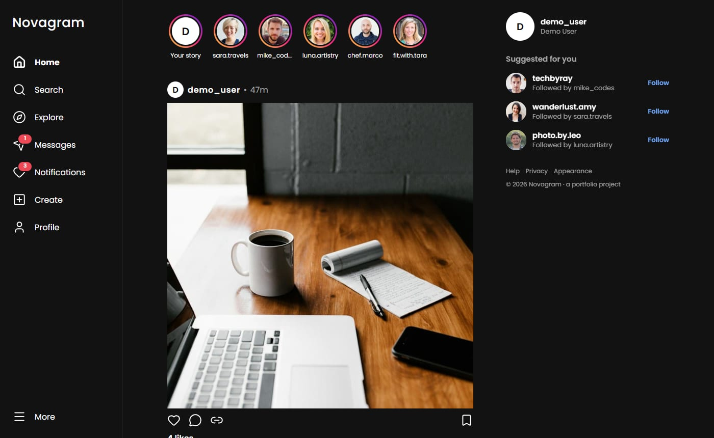
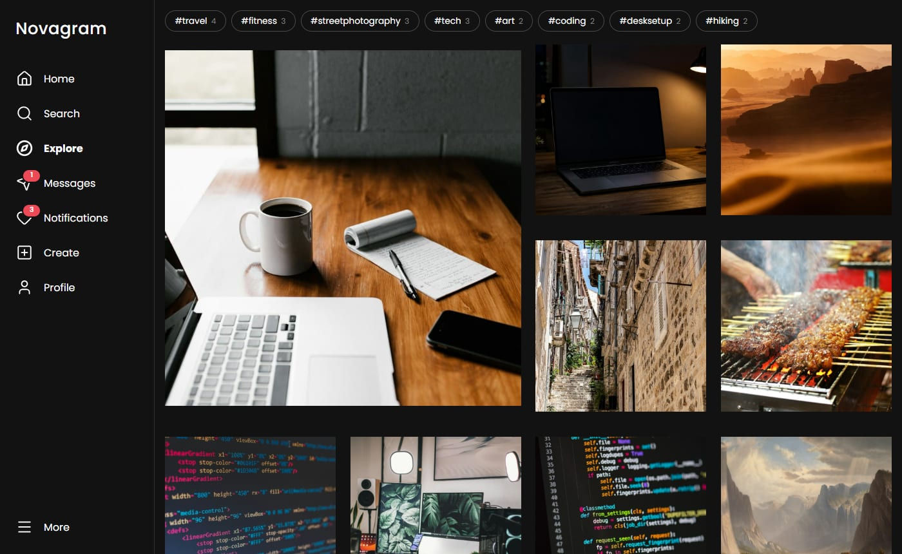
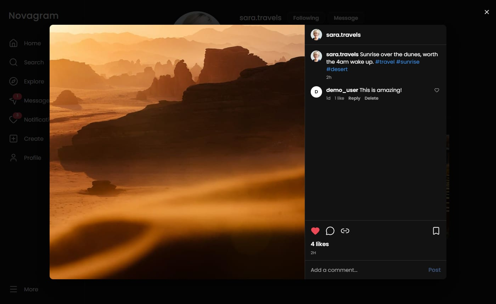
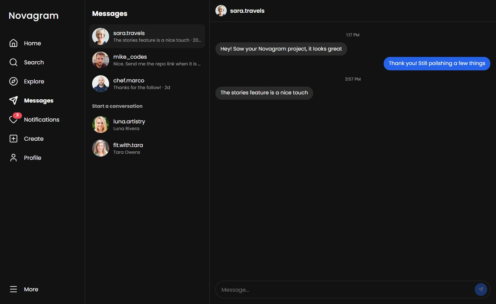
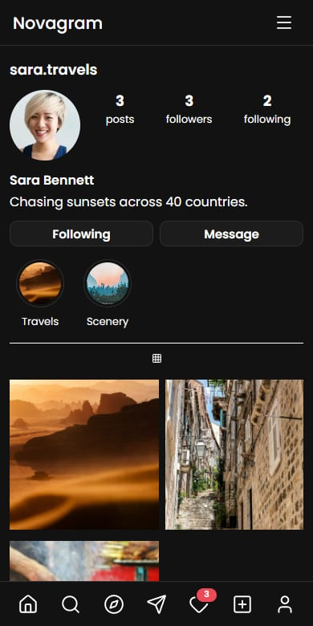

# Novagram

A photo-sharing app in the style of Instagram, built with React. Live at **[novagram.vercel.app](https://novagram.vercel.app)**. Click "Continue as demo user" on the login screen to look around without signing up.



I started this as a way to learn React properly, with a Flask + SQLAlchemy backend and cloud image uploads behind it. The hosted version doesn't run that backend. Everything lives in the browser instead (see [How the demo works](#how-the-demo-works)), so it works as a link without a server to keep alive. The Flask code isn't part of this repository.

## What you can do

- Scroll a home feed of the people you follow. Posts load as you reach the end.
- Like, comment (with replies), save and share posts. Double-click a photo to like it.
- Open any post as a modal with its own URL (`/post/:id`), so links can be shared and Back closes it.
- Watch stories, and keep them on your profile as highlights.
- Explore all posts, filter by hashtag, and search for people and tags.
- Follow and unfollow, and get notifications for likes, comments and follows.
- Message the other accounts. They reply a moment later, with a typing indicator.
- Post your own photo. It's resized in the browser before it's stored.
- Edit your profile, change your password and turn settings on and off. Light and dark themes follow your system by default.
- Use it on a phone: the sidebar becomes a bottom bar.

| | |
|---|---|
|  |  |
|  |  |

## Stack

React 19, Vite, React Router 7, TanStack Query 5, and plain CSS modules. There is no CSS framework and no state library beyond React Query and a couple of small contexts. Icons come from lucide-react.

## How the demo works

`src/mock/api.js` is a stand-in for the REST API. It exposes the same kind of async functions the real backend did (`getHomeFeed`, `toggleLikePost`, `addComment` and so on) and stores its data in `localStorage` under one key, with a short artificial delay so loading states are real. The UI only talks to those functions, so pointing it back at a real server means rewriting that one file.

Two things go a little beyond a plain CRUD mock. The seeded accounts react to what you do: after you post, a few of them like and comment over the next several seconds, and they answer your messages. And `db.js` has small migrations so an older saved state upgrades instead of breaking.

Everything is per browser, so nothing you do is visible to anyone else. **Settings → Help → Reset demo data** puts it back to the start.

## Things I paid attention to

**Server state.** Feeds use `useInfiniteQuery`. Likes, saves and follows update the screen immediately and roll back if the request fails. After a mutation only the affected queries are invalidated, not the whole cache.

**Code splitting.** Each page is its own chunk, and the browser fetches the rest while idle after login. The login page ships in the main bundle because it's the first thing a new visitor sees. The initial JavaScript is about 85 kB gzipped, down from 149 kB when it was one bundle.

**Accessibility.** Dialogs trap focus, close on Escape and give focus back to what opened them. There's a skip link, page titles change on navigation, and menus and search results work with the arrow keys. I ran axe-core over 20 pages and states in both themes and it reports no violations; Lighthouse gives 100 for accessibility on every page I tested. Automated tools catch only part of the problems, so I also tabbed through it by hand.

**Design tokens.** Colours, spacing, radii and type sizes are CSS variables in `src/styles/tokens.css`. The dark theme is a second set of values for the same names, and each colour pair was checked for contrast.

**Performance.** Lighthouse on the production build, with simulated throttling:

| | Performance | Accessibility | Best practices | SEO |
|---|---|---|---|---|
| Desktop, home | 98 | 100 | 100 | 100 |
| Mobile (slow 4G), home | 84 | 100 | 100 | 100 |

The mobile score is held back by the size of the photos. Explore is the weakest page there, at 78, because it loads a grid of full-size images instead of thumbnails.

## Running it locally

You need Node 20.19 or newer.

```bash
npm install
npm run dev
```

The demo account is `demo_user` with the password `demo1234`, or use the demo button on the login page.

```bash
npm run build     # production build in dist/
npm run preview   # serve that build locally
```

## Project layout

```
src/
  mock/         localStorage-backed API and seed data
  pages/        one folder or file per route
  components/   shared UI: sidebar, feed post, dialogs, stories
  components/UI Kit/   buttons, switches, skeletons, scroll row
  hooks/        useDialog (focus trap), useInfiniteScroll
  context/      theme and toast providers
  styles/       design tokens
  routes.js     the lazy-loaded page list
public/seed/    photos used by the seed data
```

## Known gaps

- No real backend, accounts or sharing between browsers.
- The privacy and email settings save but don't change anything else in the demo.
- Explore should use small thumbnails rather than the full images.
- The seeded accounts' profile pictures are loaded from randomuser.me, so they depend on that site being up.
